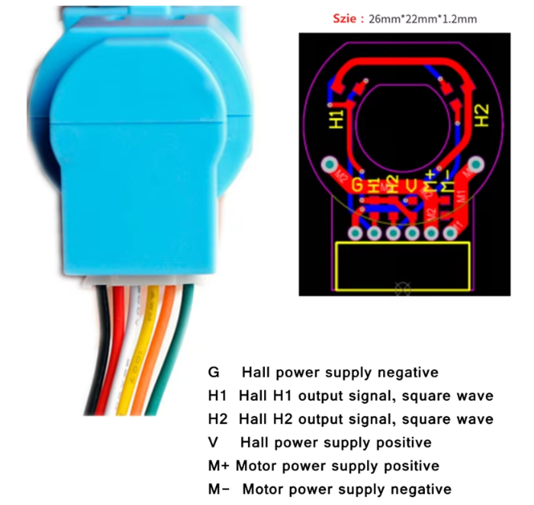

# ELEC4020 Embedded Systems Sample

## Introduction
This repository contains middle-layer libraries for common peripherals and modules used in embedded systems. These resources will support you in completing the final project in the course.


## Requirement
- IDE: Code Composer Studio 12.5.0
- Library: TivaWare C Series 1.1
- Kit: Tiva C Series TM4C123G LaunchPad

## Table of content
1. [Introduction](#introduction)
2. [Requirement](#requirement)
3. [Peripheral Libraries](#peripheral-libraries)
   - [ADC Library](#adc)
     - [ADCSingleRead](#1-adcsingleread)
     - [ADCInit](#2-adcinit)
     - [ADCRegisterCallback](#3-adcregistercallback)
     - [ADCTriggerConversion](#4-ADCTriggerConversion)
     - [Example](#example)
   - [I2C Library](#i2c)
     - [I2CInit](#1-i2cinit)
     - [I2CWriteSingleByte](#2-i2cwritesinglebyte)
     - [I2CWriteMultiByte](#3-i2cwritemultibyte)
     - [I2CReadSingleByte](#4-i2creadsinglebyte)
     - [I2CReadMultiByte](#5-i2creadmultibyte)
     - [Example](#example-1)
   - [SPI (SSI) Library](#ssi)
     - [SSIInit](#1-ssiinit)
     - [SSIWriteSingleByte](#2-ssiwritesinglebyte)
     - [SSIWriteMultiByte](#3-ssiwritemultibyte)
     - [SSIReadSingleByte](#4-ssireadsinglebyte)
     - [SSIReadMultiByte](#5-ssireadmultibyte)
     - [SSIReadWriteSingleByte](#6-ssireadwritesinglebyte)
     - [SSIReadWriteMultiByte](#7-ssireadwritemultibyte)
     - [Example](#example-2)
   - [UART Library](#uart)
     - [UARTInit](#1-uartinit)
     - [UARTRead](#2-uartread)
     - [UARTWrite](#3-uartwrite)
     - [UARTQueryData](#4-uartquerydata)
     - [UARTWriteCMD](#5-uartwritecmd)
     - [Example](#example-3)
4. [Modules](#module-sample)
   - [DC Motor](#dc-motor)
     - [MotorsInit](#1-motorsinit)
     - [MotorsSetSpeed](#2-motorssetspeed)
     - [Example](#example-4)
   - [OLED SSD1306](#oled-ssd1306)
     - [OLEDInit](#1-oledinit)
     - [OLEDDisplayOn](#2-oleddisplayon)
     - [OLEDDisplayOff](#3-oleddisplayoff)
     - [OLEDResetDisplay](#4-oledresetdisplay)
     - [OLEDClearDisplay](#5-oledcleardisplay)
     - [OLEDSetXY](#6-oledsetxy)
     - [OLEDSetPixelXY](#7-oledsetpixelxy)
     - [OLEDSendCharXY](#8-oledsendcharxy)
     - [OLEDSendStrXY](#9-oledsendstrxy)
     - [OLEDDisplayBitmap](#10-oleddisplaybitmap)
     - [Example](#example-5)
   - [Joystick](#joystick)
     - [Example](#example-6)
   - [MPU6050 IMU](#mpu6050-imu)
   - [RTC 1307](#rtc-ds1307-real-time-clock)
4. [Utilility](#utilility)
   - [Scheduler](#scheduler)
   - [FSM](#finite-state-machine-fsm)
   - [PID](#pid)
   - [Kalman filter](#kalman-filter)
   - [Complementary filter](#complementary-filter)
5. [Contribution](#contribution)


## Peripheral libraries
These libraries offer a foundation for working with key peripherals. 

### ADC
Here’s a basic library for the Tiva C TM4C123G microcontroller, which includes ADC functions for reading analog data from single or multiple channels. The library uses the ADC hardware and includes a callback function for handling the ADC data upon interrupt.

#### **1. ADCSingleRead**
```c
uint32_t ADCSingleRead(uint8_t ui8PinName);
```

- **Description**: Reads the analog value from a specified single pin without initialization.
- **Parameters**: 
  - `ui8PinName`: The pin number of the analog input channel, using the defined constants (`AIN0`, `AIN1`, etc.).
- **Returns**: 
  - The 12-bit ADC result (0 - 4095).
- **Usage**:
  ```c
  uint32_t adcValue = ADCSingleRead(AIN0); // Reads ADC value from AIN0 (PE3)
  ```

#### **2. ADCInit**
```c
void ADCInit(uint8_t * pui8Pins, uint8_t ui8NoPins);
```

- **Description**: Initializes the ADC for multiple channels.
- **Parameters**: 
  - `pui8Pins`: Pointer to an array of pins to be initialized for ADC.
  - `ui8NoPins`: Number of pins in the `pui8Pins` array.
- **Usage**:
  ```c
  uint8_t pins[] = {AIN0, AIN1, AIN2}; // Define pins for ADC conversion
  ADCInit(pins, 3); // Initialize ADC for three pins
  ```

#### **3. ADCRegisterCallback**
```c
void ADCRegisterCallback(adc_callback_func_t pcallback);
```

- **Description**: Registers a callback function that is triggered in the ADC interrupt when a conversion is complete.
- **Parameters**: 
  - `pcallback`: A function pointer to a callback function that handles the ADC results.
- **Usage**:
  ```c
  void ADCCallback(uint32_t * ui32Buffer) {
      // Process ADC data
  }
  ADCRegisterCallback(ADCCallback); // Register the callback function
  ```

#### **4. ADCTriggerConversion**
```c
void ADCTriggerConversion();
```

- **Description**: Manually triggers an ADC conversion for all initialized channels.
- **Usage**:
  ```c
  ADCTriggerConversion(); // Start ADC conversion on initialized channels
  ```

#### Example
This example sets up the ADC for three channels, registers a callback function for handling the ADC results, and triggers the conversion in an infinite loop.
```c
#include <stdint.h>
#include <stdbool.h>
#include "driverlib/sysctl.h"
#include "libs/adc/adc.h"

uint32_t gui32Buffer[8];

void ADCCallback(uint32_t * ui32Buffer) {
    uint8_t ui32Idx = 0;
    for(ui32Idx = 0; ui32Idx < 8; ui32Idx++) {
        gui32Buffer[ui32Idx] = ui32Buffer[ui32Idx];
    }
}

void main() {
    SysCtlClockSet(SYSCTL_SYSDIV_2_5|SYSCTL_USE_PLL|SYSCTL_XTAL_16MHZ|SYSCTL_OSC_MAIN); // 80 MHz
    
    uint8_t ui8Pins[] = {AIN7, AIN6};       // Define ADC pins
    ADCInit(ui8Pins, 2);                    // Initialize ADC on these pins
    ADCRegisterCallback(&ADCCallback);      // Register the callback

    while (1) {
        ADCTriggerConversion();              // Trigger conversion
        // Other code
    }
}
```

### I2C
This library provides functions for initializing and using the I2C modules on the Tiva C TM4C123G microcontroller. It supports both single-byte and multi-byte read and write operations for I2C devices.

#### **1. I2CInit**
```c
void I2CInit(uint32_t i2c);
```

- **Description**: Initializes the specified I2C module for communication.
- **Parameters**:
  - `i2c`: I2C module base address, which should be one of the following predefined values: `I2C0`, `I2C1`, `I2C2`, or `I2C3`.
- **Usage**:
  ```c
  I2CInit(I2C0); // Initializes I2C0 module for communication
  ```

---

#### **2. I2CWriteSingleByte**
```c
void I2CWriteSingleByte(uint32_t ui32Id, uint8_t ui8Addr, uint8_t ui8RegAddr, uint8_t ui8Data);
```

- **Description**: Writes a single byte of data to a specified register address on an I2C device.
- **Parameters**:
  - `ui32Id`: I2C module base address, e.g., `I2C0`.
  - `ui8Addr`: The 7-bit I2C address of the target device.
  - `ui8RegAddr`: The register address on the target device where the data will be written.
  - `ui8Data`: The byte of data to write.
- **Usage**:
  ```c
  I2CWriteSingleByte(I2C0, 0x3C, 0x10, 0xFF); // Writes 0xFF to register 0x10 on device at address 0x3C
  ```

---

#### **3. I2CWriteMultiByte**
```c
void I2CWriteMultiByte(uint32_t ui32Id, uint8_t ui8Addr, uint8_t ui8RegAddr, uint8_t* pui8Data, uint8_t ui8Length);
```

- **Description**: Writes multiple bytes of data starting from a specified register address on an I2C device.
- **Parameters**:
  - `ui32Id`: I2C module base address, e.g., `I2C0`.
  - `ui8Addr`: The 7-bit I2C address of the target device.
  - `ui8RegAddr`: The starting register address on the target device.
  - `pui8Data`: Pointer to an array containing the data bytes to be written.
  - `ui8Length`: Number of bytes to write.
- **Usage**:
  ```c
  uint8_t data[] = {0x01, 0x02, 0x03};
  I2CWriteMultiByte(I2C0, 0x3C, 0x20, data, 3); // Writes 0x01, 0x02, 0x03 to registers starting at 0x20 on device at address 0x3C
  ```

---

#### **4. I2CReadSingleByte**
```c
uint8_t I2CReadSingleByte(uint32_t ui32Id, uint8_t ui8Addr, uint8_t ui8RegAddr);
```

- **Description**: Reads a single byte of data from a specified register address on an I2C device.
- **Parameters**:
  - `ui32Id`: I2C module base address, e.g., `I2C0`.
  - `ui8Addr`: The 7-bit I2C address of the target device.
  - `ui8RegAddr`: The register address on the target device from which data will be read.
- **Returns**: 
  - The byte of data read from the specified register.
- **Usage**:
  ```c
  uint8_t data = I2CReadSingleByte(I2C0, 0x3C, 0x10); // Reads a byte from register 0x10 on device at address 0x3C
  ```

---

#### **5. I2CReadMultiByte**
```c
void I2CReadMultiByte(uint32_t ui32Id, uint8_t ui8Addr, uint8_t ui8RegAddr, uint8_t* pui8Data, uint8_t ui8Length);
```

- **Description**: Reads multiple bytes of data starting from a specified register address on an I2C device.
- **Parameters**:
  - `ui32Id`: I2C module base address, e.g., `I2C0`.
  - `ui8Addr`: The 7-bit I2C address of the target device.
  - `ui8RegAddr`: The starting register address on the target device.
  - `pui8Data`: Pointer to an array where the read data will be stored.
  - `ui8Length`: Number of bytes to read.
- **Usage**:
  ```c
  uint8_t data[3];
  I2CReadMultiByte(I2C0, 0x3C, 0x20, data, 3); // Reads 3 bytes starting at register 0x20 on device at address 0x3C
  ```

---

#### Example
This example demonstrates initializing the I2C module, writing and reading single bytes, and handling multi-byte data transfers with an I2C device.
```c
#include <stdint.h>
#include <stdbool.h>
#include "driverlib/sysctl.h"
#include "libs/i2c/i2c.h"

void main() {
    SysCtlClockSet(SYSCTL_SYSDIV_2_5|SYSCTL_USE_PLL|SYSCTL_XTAL_16MHZ|SYSCTL_OSC_MAIN); // 80 MHz

    I2CInit(I2C0); // Initialize I2C0 module

    uint8_t dataToWrite = 0x5A;
    I2CWriteSingleByte(I2C0, 0x3C, 0x10, dataToWrite); // Write a single byte

    uint8_t dataToRead = I2CReadSingleByte(I2C0, 0x3C, 0x10); // Read a single byte

    uint8_t multiWriteData[] = {0x01, 0x02, 0x03};
    I2CWriteMultiByte(I2C0, 0x3C, 0x20, multiWriteData, 3); // Write multiple bytes

    uint8_t multiReadData[3];
    I2CReadMultiByte(I2C0, 0x3C, 0x20, multiReadData, 3); // Read multiple bytes

    while(1) {

    }
}
```

### SSI
This library allows communication with devices over SSI (SPI), configured in master mode only. It includes functions for reading and writing data both as single bytes and in multiple bytes.

---

#### **1. SSIInit**
```c
void SSIInit(uint8_t ui8Id);
```

- **Description**: Initializes the specified SSI module for communication in master mode.
- **Parameters**:
  - `ui8Id`: Identifier for the SSI module, defined as one of `SSI0`, `SSI1`, `SSI2`, or `SSI3`.
- **Usage**:
  ```c
  SSIInit(SSI0); // Initializes SSI0 module for communication
  ```

---

#### **2. SSIWriteSingleByte**
```c
void SSIWriteSingleByte(uint8_t ui8Id, uint8_t ui8RegAddr, uint8_t ui8Data);
```

- **Description**: Writes a single byte to a specified register address on an SSI device.
- **Parameters**:
  - `ui8Id`: SSI module identifier, e.g., `SSI0`.
  - `ui8RegAddr`: Register address on the target device where data will be written.
  - `ui8Data`: The byte of data to write.
- **Usage**:
  ```c
  SSIWriteSingleByte(SSI0, 0x10, 0xFF); // Writes 0xFF to register 0x10 on the device connected to SSI0
  ```

---

#### **3. SSIWriteMultiByte**
```c
void SSIWriteMultiByte(uint8_t ui8Id, uint8_t ui8RegAddr, uint8_t* pui8Data, uint8_t ui8Length);
```

- **Description**: Writes multiple bytes of data to a specified register address on an SSI device.
- **Parameters**:
  - `ui8Id`: SSI module identifier, e.g., `SSI0`.
  - `ui8RegAddr`: Register address on the target device where data will be written.
  - `pui8Data`: Pointer to an array containing the data bytes to write.
  - `ui8Length`: Number of bytes to write.
- **Usage**:
  ```c
  uint8_t data[] = {0x01, 0x02, 0x03};
  SSIWriteMultiByte(SSI0, 0x20, data, 3); // Writes 0x01, 0x02, 0x03 starting at register 0x20 on device connected to SSI0
  ```

---

#### **4. SSIReadSingleByte**
```c
uint16_t SSIReadSingleByte(uint8_t ui8Id, uint8_t ui8RegAddr);
```

- **Description**: Reads a single byte from a specified register address on an SSI device.
- **Parameters**:
  - `ui8Id`: SSI module identifier, e.g., `SSI0`.
  - `ui8RegAddr`: Register address on the target device from which data will be read.
- **Returns**: 
  - The byte of data read from the specified register.
- **Usage**:
  ```c
  uint16_t data = SSIReadSingleByte(SSI0, 0x10); // Reads a byte from register 0x10 on device connected to SSI0
  ```

---

#### **5. SSIReadMultiByte**
```c
void SSIReadMultiByte(uint8_t ui8Id, uint8_t ui8RegAddr, uint8_t* pui8Data, uint8_t ui8Length);
```

- **Description**: Reads multiple bytes from a specified register address on an SSI device.
- **Parameters**:
  - `ui8Id`: SSI module identifier, e.g., `SSI0`.
  - `ui8RegAddr`: Starting register address on the target device.
  - `pui8Data`: Pointer to an array where the read data will be stored.
  - `ui8Length`: Number of bytes to read.
- **Usage**:
  ```c
  uint8_t data[3];
  SSIReadMultiByte(SSI0, 0x20, data, 3); // Reads 3 bytes starting at register 0x20 on device connected to SSI0
  ```

---

#### **6. SSIReadWriteSingleByte**
```c
uint16_t SSIReadWriteSingleByte(uint8_t ui8Id, uint8_t ui8Data);
```

- **Description**: Simultaneously writes and reads a single byte, allowing full-duplex communication with an SSI device.
- **Parameters**:
  - `ui8Id`: SSI module identifier, e.g., `SSI0`.
  - `ui8Data`: The byte of data to be written.
- **Returns**: 
  - The byte read during the write operation.
- **Usage**:
  ```c
  uint16_t receivedData = SSIReadWriteSingleByte(SSI0, 0xAA); // Sends 0xAA and receives a byte from the SSI device
  ```

---

#### **7. SSIReadWriteMultiByte**
```c
void SSIReadWriteMultiByte(uint8_t ui8Id, uint8_t* pui8ReadData, uint8_t* pui8WriteData, uint8_t ui8Length);
```

- **Description**: Simultaneously writes and reads multiple bytes, allowing full-duplex communication with an SSI device.
- **Parameters**:
  - `ui8Id`: SSI module identifier, e.g., `SSI0`.
  - `pui8ReadData`: Pointer to an array where the received data will be stored.
  - `pui8WriteData`: Pointer to an array containing the data bytes to be sent.
  - `ui8Length`: Number of bytes to transfer.
- **Usage**:
  ```c
  uint8_t writeData[] = {0x01, 0x02, 0x03};
  uint8_t readData[3];
  SSIReadWriteMultiByte(SSI0, readData, writeData, 3); // Writes 0x01, 0x02, 0x03 and simultaneously reads 3 bytes
  ```

---

#### Example
This example demonstrates initialization, single-byte and multi-byte read/write operations, as well as full-duplex data exchange on an SSI device.
```c
#include <stdint.h>
#include <stdbool.h>
#include "driverlib/sysctl.h"
#include "libs/ssi/ssi.h"

void main() {
    SysCtlClockSet(SYSCTL_SYSDIV_2_5|SYSCTL_USE_PLL|SYSCTL_XTAL_16MHZ|SYSCTL_OSC_MAIN); // 80 MHz

    SSIInit(SSI0); // Initialize SSI0

    SSIWriteSingleByte(SSI0, 0x10, 0xFF); // Write a single byte to register 0x10

    uint16_t data = SSIReadSingleByte(SSI0, 0x10); // Read a single byte from register 0x10

    uint8_t multiWriteData[] = {0x01, 0x02, 0x03};
    SSIWriteMultiByte(SSI0, 0x20, multiWriteData, 3); // Write multiple bytes

    uint8_t multiReadData[3];
    SSIReadMultiByte(SSI0, 0x20, multiReadData, 3); // Read multiple bytes

    uint16_t readWriteData = SSIReadWriteSingleByte(SSI0, 0xAA); // Full-duplex single-byte

    uint8_t fullDuplexWrite[] = {0x10, 0x20, 0x30};
    uint8_t fullDuplexRead[3];
    SSIReadWriteMultiByte(SSI0, fullDuplexRead, fullDuplexWrite, 3); // Full-duplex multi-byte

    while(1) {

    }
}
```

### UART
This library provides functions to initialize and use the UART interface on the Tiva C TM4C123G microcontroller. Depending on the `DEBUG` flag, it will either use UART0 or UART1, with UART0 used for debugging and UART1 for other applications.

---

#### **1. UARTInit**
```c
void UARTInit();
```

- **Description**: Initializes the UART module based on the `DEBUG` flag. Sets the baud rate, data width, stop bits, and parity configuration.
- **Parameters**: None
- **Usage**:
  ```c
  UARTInit(); // Initializes UART based on DEBUG flag
  ```

---

#### **2. UARTRead**
```c
void UARTRead(uint8_t * buf, uint16_t len);
```

- **Description**: Reads data from the UART interface into a buffer. This function retrieves `len` bytes of data.
- **Parameters**:
  - `buf`: Pointer to the buffer where the received data will be stored.
  - `len`: Number of bytes to read from UART.
- **Usage**:
  ```c
  uint8_t buffer[10];
  UARTRead(buffer, 10); // Reads 10 bytes from UART into buffer
  ```

---

#### **3. UARTWrite**
```c
void UARTWrite(uint8_t* cBuff, uint16_t ui16Len);
```

- **Description**: Writes data to the UART interface from a buffer.
- **Parameters**:
  - `cBuff`: Pointer to the buffer containing the data to send.
  - `ui16Len`: Number of bytes to write to UART.
- **Usage**:
  ```c
  uint8_t data[2] = {0x40, 0x0A};
  UARTWrite(data, 2);
  ```

---

#### **4. UARTQueryData**
```c
uint16_t UARTQueryData();
```

- **Description**: Checks how much data is available in the UART receive buffer.
- **Returns**: 
  - The number of bytes available to read from UART.
- **Usage**:
  ```c
  uint16_t dataAvailable = UARTQueryData(); // Queries the number of available bytes in the UART buffer
  ```

---

#### **5. UARTWriteCMD**
```c
void UARTWriteCMD(char* cBuff);
```

- **Description**: Sends a command string over UART.
- **Parameters**:
  - `cBuff`: Pointer to the string.
- **Usage**:
  ```c
  UARTWriteCMD("Hello, ELEC4020 Embedded Systems"); // Sends "AT+RST" command over UART
  ```

---

#### Example
This example demonstrates initializing the UART, writing and reading data, querying available data, and sending a command string over UART. The UART module used depends on whether the `DEBUG` flag is defined.
```c
#include <stdint.h>
#include <stdbool.h>
#include "driverlib/sysctl.h"
#include "libs/uart/uart.h"

void main() {
    SysCtlClockSet(SYSCTL_SYSDIV_2_5|SYSCTL_USE_PLL|SYSCTL_XTAL_16MHZ|SYSCTL_OSC_MAIN); // 80 MHz

    UARTInit(); // Initialize UART

    uint8_t message[] = "ELEC4020 Embedded Systems";
    UARTWrite(message, sizeof(message) - 1); // Write a message to UART

    uint8_t receivedData[20];
    UARTRead(receivedData, 20); // Read 20 bytes of data from UART

    uint16_t availableData = UARTQueryData(); // Check available data in UART buffer

    UARTWriteCMD("AT+GMR"); // Send an AT command over UART

    while(1) {

    }
}
```


## Module sample
Explore these modules for specialized functionality.
### DC Motor
This library facilitates control of multiple motors using PWM (Pulse Width Modulation). It allows for initialization of specified PWM modules and speed control for each motor using a configured PWM frequency.

---

#### **1. MotorsInit**
```c
void MotorsInit(pwm_mod_t * pConfig, uint8_t ui8NoMotors);
```

- **Description**: Initializes the specified PWM modules for motor control at the defined frequency (1 kHz by default).
- **Parameters**:
  - `pConfig`: Pointer to an array of PWM module configurations (`pwm_mod_t` values) specifying the modules to initialize.
  - `ui8NoMotors`: Number of motors (or PWM modules) to initialize, corresponding to the length of `pConfig`.
- **Usage**:
  ```c
  pwm_mod_t motorConfig[] = {PWM_MOD0_GEN0, PWM_MOD0_GEN1};
  MotorsInit(motorConfig, 2); // Initializes two motors using PWM_MOD0_GEN0 and PWM_MOD0_GEN1
  ```

---

#### **2. MotorsSetSpeed**
```c
void MotorsSetSpeed(uint8_t ui8Id, uint8_t ui8Speed);
```

- **Description**: Sets the speed of a specific motor by adjusting its PWM duty cycle.
- **Parameters**:
  - `ui8Id`: Identifier for the motor (corresponding to the index of the motor in the `pConfig` array provided to `MotorsInit`).
  - `ui8Speed`: Speed of the motor as a percentage (0-100). A value of 0 stops the motor, while 100 sets it to full speed.
- **Usage**:
  ```c
  MotorsSetSpeed(0, 75);
  ```

---

#### Example
##### Components


This image is borrowed from [lastminuteengineers.com](https://lastminuteengineers.com/l298n-dc-stepper-driver-arduino-tutorial/)




This motor can be found at [Vietnam store](https://hshop.vn/dong-co-dc-servo-geared-tt-motor-with-encoder-ratio-1-84) and [International store](https://www.sparkfun.com/products/16413). No advertising here, just give you a reference.

#### Schematics
In this example, we used the **Module 1 PWM Generator 3** with the deadband configuration. Please check **Table 20-1, page 1233** in the datasheet for the other module and PWM generator.
```bash
L298N module
VS          --->    6 - 9 V
GND         --->    GND of power supply and Tiva C
OUT1        --->    MOTOR POWER SUPPLY POSITIVE
OUT2        --->    MOTOR POWER SUPPLY NEGATIVE
IN1         --->    PF2 (Tiva C)
IN2         --->    PF3 (Tiva C)
```

##### Code
```c
#include <stdint.h>
#include <stdbool.h>
#include "driverlib/sysctl.h"
#include "modules/dc_motor/motor.h"

void main() {
    SysCtlClockSet(SYSCTL_SYSDIV_2_5|SYSCTL_USE_PLL|SYSCTL_XTAL_16MHZ|SYSCTL_OSC_MAIN); // 80 MHz

    pwm_mod_t motorList = PWM_MOD1_GEN3;
    MotorsInit(&motorList, 1);

    uint8_t ui8Speed = 50;
    uint8_t ui8Increase = 1;
    uint32_t ui32Position = 0;

    MotorsSetSpeed(0, 50);

    while(1) {
        MotorsSetSpeed(0, ui8Speed);

        if(ui8Speed <= 5) {
            ui8Increase = 1;
        }
        else if(ui8Speed >= 90) {
            ui8Increase = 0;
        }
        if(ui8Increase) {
            ui8Speed += 5;
        }
        else {
            ui8Speed -= 5;
            ui8Speed = ui8Speed == 0 ? 1 : ui8Speed;
        }

        SysCtlDelay(SysCtlClockGet()/30);
    }
}
```

### OLED SSD1306
This library allows control over an OLED display (SSD1306 128x64) using I2C communication, specifically configured to use `I2C3` on the TM4C123G microcontroller (SCL on PD0 and SDA on PD1). It includes functions for turning the display on or off, clearing or resetting it, and setting individual pixels or characters.

#### **Hardware Connections**
- **GND** → GND
- **VCC** → 3.3V
- **SCL** → PD0
- **SDA** → PD1


---

#### **1. OLEDInit**
```c
void OLEDInit();
```

- **Description**: Initializes the OLED display over I2C, setting it up for communication and clearing any previous data.
- **Parameters**: None
- **Usage**:
  ```c
  OLEDInit(); // Initializes the OLED display
  ```

---

#### **2. OLEDDisplayOn**
```c
void OLEDDisplayOn();
```

- **Description**: Turns on the OLED display.
- **Parameters**: None
- **Usage**:
  ```c
  OLEDDisplayOn(); // Turns on the OLED display
  ```

---

#### **3. OLEDDisplayOff**
```c
void OLEDDisplayOff();
```

- **Description**: Turns off the OLED display.
- **Parameters**: None
- **Usage**:
  ```c
  OLEDDisplayOff(); // Turns off the OLED display
  ```

---

#### **4. OLEDResetDisplay**
```c
void OLEDResetDisplay();
```

- **Description**: Resets the OLED display, clearing the screen and reinitializing display settings.
- **Parameters**: None
- **Usage**:
  ```c
  OLEDResetDisplay(); // Resets the OLED display
  ```

---

#### **5. OLEDClearDisplay**
```c
void OLEDClearDisplay();
```

- **Description**: Clears the display, removing all content currently shown on the screen.
- **Parameters**: None
- **Usage**:
  ```c
  OLEDClearDisplay(); // Clears all content on the OLED display
  ```

---

#### **6. OLEDSetXY**
```c
void OLEDSetXY(uint8_t ui8Row, uint8_t ui8Col);
```

- **Description**: Sets the cursor position on the display for future character or pixel placement.
- **Parameters**:
  - `ui8Row`: Row position (Y-axis) on the display.
  - `ui8Col`: Column position (X-axis) on the display.
- **Usage**:
  ```c
  OLEDSetXY(2, 10); // Sets the cursor to row 2, column 10
  ```

---

#### **7. OLEDSetPixelXY**
```c
void OLEDSetPixelXY(uint8_t ui8X, uint8_t ui8Y);
```

- **Description**: Sets a single pixel on the display at the specified (X, Y) coordinates.
- **Parameters**:
  - `ui8X`: X-coordinate of the pixel.
  - `ui8Y`: Y-coordinate of the pixel.
- **Usage**:
  ```c
  OLEDSetPixelXY(15, 20); // Sets a pixel at coordinates (15, 20)
  ```

---

#### **8. OLEDSendCharXY**
```c
void OLEDSendCharXY(char cData, uint8_t ui8X, uint8_t ui8Y);
```

- **Description**: Displays a single character at a specified (X, Y) position.
- **Parameters**:
  - `cData`: Character to display.
  - `ui8X`: X-coordinate for character position.
  - `ui8Y`: Y-coordinate for character position.
- **Usage**:
  ```c
  OLEDSendCharXY('A', 5, 10); // Displays character 'A' at (5, 10)
  ```

---

#### **9. OLEDSendStrXY**
```c
void OLEDSendStrXY(char *cString, uint8_t ui8X, uint8_t ui8Y);
```

- **Description**: Displays a string starting at a specified (X, Y) position on the OLED.
- **Parameters**:
  - `cString`: Pointer to the null-terminated string to display.
  - `ui8X`: Starting X-coordinate for the string.
  - `ui8Y`: Starting Y-coordinate for the string.
- **Usage**:
  ```c
  OLEDSendStrXY("Hello!", 0, 0); // Displays "Hello!" starting at the top-left corner
  ```

---

#### **10. OLEDDisplayBitmap**
```c
void OLEDDisplayBitmap(const uint8_t *bitmap);
```

- **Description**: Displays a bitmap image on the OLED display.
- **Parameters**:
  - `bitmap`: Pointer to the array containing the bitmap data.
- **Usage**:
  ```c
  const uint8_t myBitmap[] = { /* bitmap data */ };
  OLEDDisplayBitmap(myBitmap); // Displays the provided bitmap on the screen
  ```

---

#### Example
This example demonstrates initializing the OLED, loading a bitmap. These functions provide an easy interface to control an I2C-connected OLED display.

```c
#include <stdint.h>
#include <stdbool.h>
#include <stdio.h>
#include "driverlib/i2c.h"
#include "inc/hw_memmap.h"
#include "driverlib/sysctl.h"
#include "driverlib/interrupt.h"
#include "modules/oled_ssd1306/ssd1306.h"
#include "modules/oled_ssd1306/ssd1306_images.h"

void main() {
    SysCtlClockSet(SYSCTL_SYSDIV_2_5|SYSCTL_USE_PLL|SYSCTL_XTAL_16MHZ|SYSCTL_OSC_MAIN); // 80 MHz

    OLEDInit();
    OLEDClearDisplay();
    OLEDDisplayBitmap(aui8Prof);

    while(1) {

    }
}
```


### Joystick
#### **Hardware Connections**
- **GND** → GND
- **+5V** → 3.3V
- **VRX** → PD0
- **VRY** → PD1


#### Example
```c
#include <stdint.h>
#include <stdbool.h>
#include "driverlib/sysctl.h"
#include "libs/adc/adc.h"

uint32_t gui32Buffer[8];

void ADCCallback(uint32_t * ui32Buffer) {
    uint8_t ui32Idx = 0;
    for(ui32Idx = 0; ui32Idx < 8; ui32Idx++) {
        gui32Buffer[ui32Idx] = ui32Buffer[ui32Idx];
    }
}

void main() {
    SysCtlClockSet(SYSCTL_SYSDIV_2_5|SYSCTL_USE_PLL|SYSCTL_XTAL_16MHZ|SYSCTL_OSC_MAIN); // 80 MHz
    
    uint8_t ui8Pins[] = {AIN7, AIN6};       // Define ADC pins
    ADCInit(ui8Pins, 2);                    // Initialize ADC on these pins
    ADCRegisterCallback(&ADCCallback);      // Register the callback

    while (1) {
        ADCTriggerConversion();              // Trigger conversion
        // Other code
    }
}
```

### MPU6050 (IMU)
Please refer to [this repository](https://github.com/minht57/TIVA_MPU6050).

### RTC DS1307 (Real-time clock)
Comming soon.

## Utilility
These utility libraries provide additional support for project development.

### Scheduler
Please refer to [this repository](https://github.com/payitforward/RaiseYourARM2015/tree/master/Timer). Add the `Timer` folder in your project. Use the `TIMER_RegisterEvent` and `TIMER_UnregisterEvent` functions to register and deregister events.

### Finite-state machine (FSM)
Please refer to [this code snippet](https://github.com/payitforward/RaiseYourARM2015/blob/master/main.c#L21-L137) to see how a `switch` statement can be used to manage system states. 

### PID
Please refer to [this repository](https://github.com/payitforward/RaiseYourARM2015/blob/master/WallFollow). Download `PID.c` and `PID.h` files and copy them into your project.

### Kalman filter
Please refer to [this repository](https://github.com/minht57/TIVA_MPU6050). Add the `MPU6050` folder in your project and call the `MPU6050_Kalman_Angle` function. It provides support for estimating roll and pitch angles using Euler angles.

### Complementary filter
Please refer to [this repository](https://github.com/minht57/TIVA_MPU6050). Add the `MPU6050` folder in your project and call the `MPU6050_Complimentary_Angle` function. It provides support for estimating roll and pitch angles using Euler angles.

### Encoder using Quadrature Encoder Interface (QEI)
Please refer to [this repository](https://github.com/payitforward/RaiseYourARM2015/tree/master/QEI). Add the `QEI` folder in your project.

## Contribution
We welcome contributions to this project! If you find issues or have improvements to suggest, feel free to create a Pull Requests or reach out to the teaching team.


## The teaching team
- Instructor: [Dr. THAI Mai Thanh](https://vinuni.edu.vn/people/thai-mai-thanh-phd-2/)
- Developer: [Tri PHAN](https://minht57.github.io/)
- Document generator: ChatGPT
